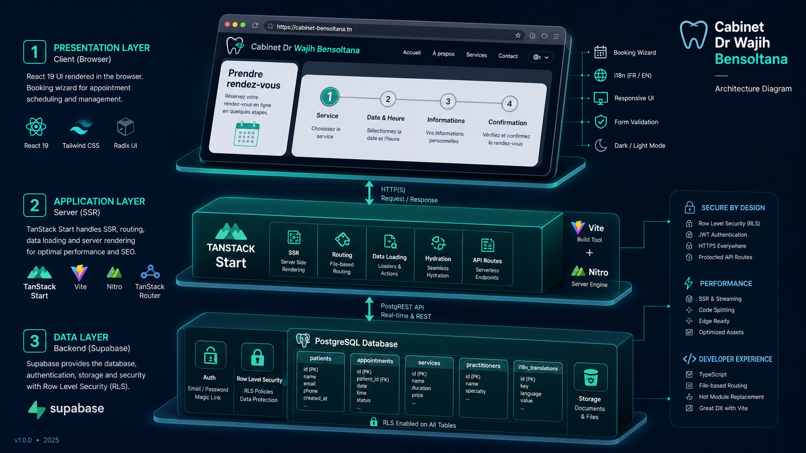
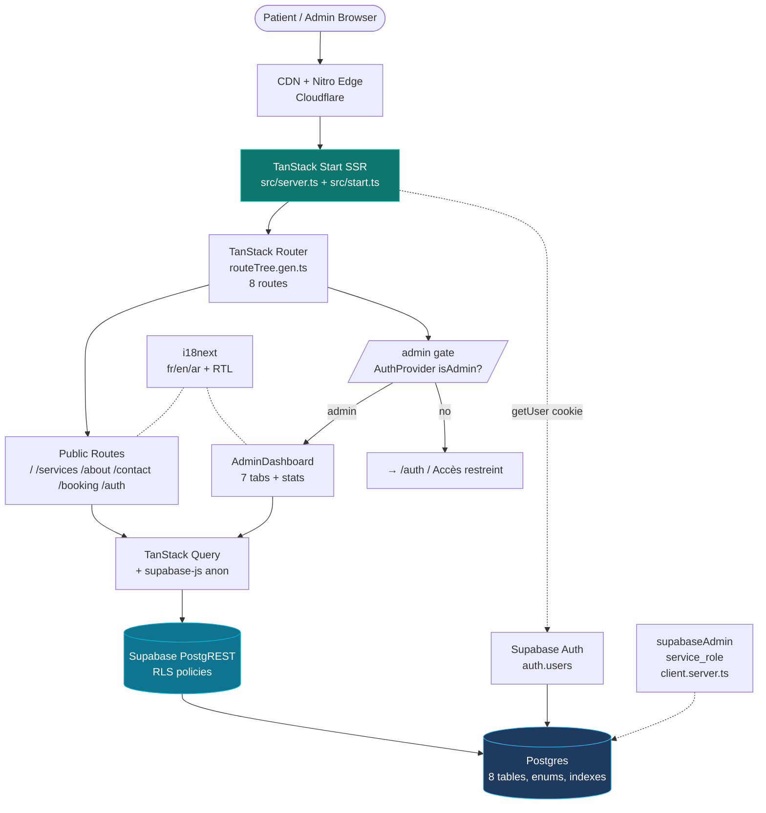
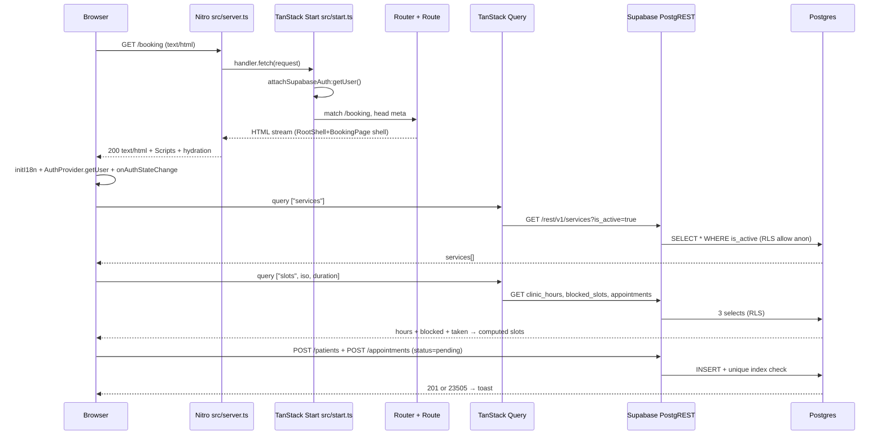
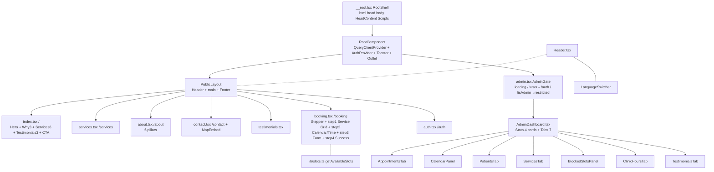

# Architecture — Cabinet Dr. Wajih Bensoltana Web

> **Project:** `KiLLua08/dr-wajih-web` — modern clinic website for a dentist in Menzel Temime, Tunisia.  
> **Stack:** TanStack Start (SSR isomorphic React) + Vite + Nitro + Supabase + i18next + Tailwind + shadcn/ui  
> **Branch:** `arena/01a086f7-dr-wajih-web` — interactive docs at `docs/architecture.html`



---

## Table of Contents
1. [TL;DR — What This Is](#1-tldr)
2. [Tech Stack](#2-tech-stack)
3. [File Tree — Guided Tour](#3-file-tree)
4. [Runtime Model — Isomorphic SSR](#4-runtime-model)
5. [Request Lifecycle](#5-request-lifecycle)
6. [Routing — File-Based TanStack Router](#6-routing)
7. [State & Data Fetching](#7-state--data)
8. [Supabase — Dual Client Pattern](#8-supabase)
9. [Auth & RBAC](#9-auth--rbac)
10. [Database & RLS](#10-database--rls)
11. [Domain Logic — Slot Engine](#11-slot-engine)
12. [UI System — Design Tokens](#12-ui-system)
13. [i18n & RTL](#13-i18n)
14. [Admin Dashboard](#14-admin)
15. [Error Resilience](#15-error-resilience)
16. [Build & Deploy](#16-build--deploy)
17. [Security Posture](#17-security)
18. [Decisions & Trade-offs](#18-decisions)
19. [Diagrams (Mermaid source)](#19-diagrams)
20. [Glossary](#20-glossary)

---

## 1. TL;DR

This is **not a SPA**. It's a **full-stack isomorphic TanStack Start app**:

- **Server** (Nitro, default Cloudflare target) renders React on every request for SEO (clinic must rank on Google.fr / Google.tn), streams HTML, then **hydrates** on the browser into a SPA.
- **Client** takes over with TanStack Router for instant navigations, TanStack Query for cached Supabase reads, and `supabase-js` directly from the browser (no custom API layer — PostgREST *is* the API).
- **Supabase Postgres** is the source of truth for everything: services, clinic hours, appointments, patients, blocked slots, testimonials, roles. Row Level Security (RLS) replaces a backend.
- An **admin dashboard** (`/admin`) gated by `user_roles.role = 'admin'` lets the clinic manage the whole domain without code deploys.
- **i18n** is first-class: `fr` (default) / `en` / `ar` with RTL flip and per-field localized columns (`name_fr`, `name_en`, `name_ar`).

If you understand three files you understand 80%: `src/start.ts` → `src/router.tsx` → `supabase/migrations/*.sql`.

---

## 2. Tech Stack

| Layer | Choice | Version | Why it matters |
|-------|--------|---------|----------------|
| **Meta-framework** | TanStack Start (`@tanstack/react-start`) | `^1.168` | SSR + file routing + server functions, successor to Remix/Next for TanStack ecosystem |
| **Routing** | TanStack Router + `routeTree.gen.ts` | `^1.170` | Type-safe file-based routes, `createFileRoute`, `Link` preloading |
| **Bundler** | Vite `^8` via `@lovable.dev/vite-tanstack-config` | `2.7.1` | Single `defineConfig` that wires Vite+Tailwind+Nitro+aliases+error reporting; hides 30 lines of boilerplate |
| **Server runtime** | **Nitro** `3.0.260603-beta` | — | Universal server, Cloudflare/Woker target by default, `src/server.ts` is the `fetch` entry |
| **Language** | TypeScript `^5.8` strict | — | `paths: @/* → ./src/*` |
| **UI** | React `^19.2` + React DOM | — | `react-jsx`, Server Components-ready |
| **Styling** | Tailwind `^4.2` + `@tailwindcss/vite` + `tw-animate-css` | — | `@theme inline` OKLCH tokens, `gradient-hero`, `shadow-soft/elegant` utilities in `src/styles.css` |
| **Components** | shadcn/ui on Radix (`dialog`, `tabs`, `calendar`, `select`...) | ~15 Radix primitives | `src/components/ui/*` — copy-paste ownership |
| **State async** | TanStack Query `^5.101` | — | Caching, `queryKey: ["services"]`, `["slots", iso, duration]` |
| **Forms** | React Hook Form `^7.71` + Zod `^3.24` + `@hookform/resolvers` | — | `patientSchema` in `booking.tsx` |
| **DB / Auth / Realtime** | Supabase (`@supabase/supabase-js ^2.110`) | PostgREST `14.5` | Postgres + RLS + Auth + Storage proxy |
| **i18n** | `i18next ^26` + `react-i18next ^17` + `i18next-browser-languagedetector` | — | `localStorage:i18nextLng` → `navigator` fallback, 3 JSON locales |
| **Dates** | `date-fns ^4` + `react-day-picker ^9` | — | `toISODate`, `fmtDate` |
| **Icons** | `lucide-react ^0.575` | — |  |
| **Charts** | `recharts ^2.15` | — | Admin future analytics |
| **Lint/format** | ESLint `^9` + `typescript-eslint` + Prettier `^3.7` | — | `eslint.config.js` |
| **Package manager** | `bun` (`bun.lock` + `bunfig.toml` 24h `minimumReleaseAge`) | — | Supply-chain guard |

> **No custom Express/Fastify.** The "API" is Postgres RLS + Supabase JS in the browser. The only server code is middleware + SSR entry.

---

## 3. File Tree

```
dr-wajih-web/
├── vite.config.ts              # 6 lines — delegates to @lovable.dev/vite-tanstack-config.
│                               # TanStack devtools, tailwindcss, nitro(target:cloudflare),
│                               # tsConfigPaths, dedupe, error logger, host/port strictness
│                               # all injected automatically. DO NOT duplicate plugins.
├── tsconfig.json               # ES2022, Bundler resolution, @/* alias, strict:true
├── bunfig.toml                 # minimumReleaseAge = 86400 (24h supply-chain guard)
├── components.json             # shadcn/ui config (tailwind + @ alias)
├── supabase/
│   ├── config.toml             # project_id = vefiungygrrkkwekydre (migrated from liolgk...)
│   ├── seed.sql                # clinic_hours + services + testimonials seed (not versioned in migration)
│   └── migrations/
│       └── 20260712...sql      # SINGLE source-of-truth schema — 8 tables, 3 enums, RLS, triggers
└── src/
    ├── styles.css              # Design system: OKLCH teal tokens, gradients, shadows, RTL font switch
    ├── router.tsx              # createRouter({ routeTree, queryClient, scrollRestoration })
    ├── routeTree.gen.ts        # AUTO-GENERATED — never edit. Declares 8 FileRoutesByPath
    ├── start.ts                # createStart({ functionMiddleware:[attachSupabaseAuth], requestMiddleware:[errorMiddleware] })
    ├── server.ts               # Nitro fetch entry — wraps handler.fetch + normalizeCatastrophicSsrResponse
    ├── routes/
    │   ├── __root.tsx          # RootShell(<html><Head><Scripts>) + RootComponent(QueryClient+Auth+Toaster)
    │   │                       # + head meta SEO + 404 + ErrorComponent
    │   ├── index.tsx           # / — Hero + Why Us (3 cards) + Services preview + Testimonials + CTA
    │   ├── services.tsx        # /services — grid of is_active services
    │   ├── about.tsx           # /about — 6 pillars + doctor card
    │   ├── contact.tsx         # /contact — form + MapEmbed + clinic_hours display
    │   ├── testimonials.tsx    # /testimonials — published only
    │   ├── booking.tsx         # /booking — 4-step wizard (Service → Date&Time → Form → Success)
    │   ├── auth.tsx            # /auth — email/password (admin only, patients are anon)
    │   ├── admin.tsx           # /admin — gate (loading → unauthed → not admin → AdminDashboard)
    │   └── README.md
    ├── components/
    │   ├── AuthProvider.tsx    # Context: user, isAdmin, loading, signOut. Subscribes to onAuthStateChange
    │   ├── PublicLayout.tsx    # Header + <main> + Footer (used by every public route)
    │   ├── Header.tsx          # Sticky nav, Link activeProps, LanguageSwitcher, admin/signout, mobile drawer
    │   ├── Footer.tsx
    │   ├── LanguageSwitcher.tsx
    │   ├── MapEmbed.tsx
    │   └── admin/
    │       ├── AdminDashboard.tsx    # Stats(4 cards) + Tabs(7 panels) — orchestrator
    │       ├── AppointmentsTab.tsx   # Table + status filter + inline edit
    │       ├── CalendarPanel.tsx     # Monthly calendar view
    │       ├── PatientsTab.tsx       # CRUD patients
    │       ├── ServicesTab.tsx       # CRUD services (trilingual fields)
    │       ├── ClinicHoursTab.tsx    # 7-day open/close toggles
    │       ├── BlockedSlotsPanel.tsx # Date + optional time blocks
    │       ├── TestimonialsTab.tsx
    │       └── ...Panels (legacy)
    ├── integrations/supabase/
    │   ├── client.ts           # BROWSER client — VITE_SUPABASE_URL + PUBLISHABLE_KEY → createClient (no proxy)
    │   ├── client.server.ts    # SERVER admin — service_role via lazy Proxy(supabaseAdmin), custom fetch for sb_ keys
    │   ├── types.ts            # Generated Database type (787 lines, 8 tables, composite helpers)
    │   ├── auth-attacher.ts    # functionMiddleware that calls supabase.auth.getUser() per request
    │   └── auth-middleware.ts  # requireSupabaseAuth — Bearer token validation via getClaims(token)
    ├── lib/
    │   ├── slots.ts            # getAvailableSlots(dateISO, durationMin): 30-min step, respects hours/blocked/taken/today+30m
    │   ├── lang.ts             # useLang() + localized(obj, field, lang) helper for _fr/_en/_ar columns
    │   ├── format.ts           # toISODate(date)→YYYY-MM-DD, fmtDate(locale)
    │   ├── error-capture.ts    # Global addEventListener('error'/'unhandledrejection') → TTL 5s buffer
    │   ├── error-page.ts       # renderErrorPage() → static HTML fallback for catastrophic SSR failure
    │   ├── lovable-error-reporting.ts
    │   └── utils.ts            # cn() tailwind-merge
    ├── hooks/use-mobile.tsx
    └── i18n/
        ├── index.ts            # initI18n() + applyDirection(lang) → <html dir lang>
        └── locales/{fr,en,ar}.json  # ~120 keys each, booking.* admin.* etc.
```

**Key observation:** `src/routes`, `src/components/admin`, and `supabase/migrations` are the three gravity wells. Everything else is glue.

---

## 4. Runtime Model

```
┌─────────────────────────────────────────────────────────────────────┐
│                        TANSTACK START ISOMORPHIC                     │
│                                                                     │
│  Dev:  vite dev  (HMR, TanStack devtools first plugin)             │
│  Build: vite build → client bundle (React) + server bundle (Nitro) │
│  Preview: vite preview / nitro preview                              │
│                                                                     │
│  Vite config is *inherited* — @lovable.dev/vite-tanstack-config    │
│  already injects: tanstackStart, viteReact, tailwindcss,           │
│  tsConfigPaths, nitro(cloudflare), VITE_* env, @ alias, dedupe,   │
│  error-logger, sandbox port/host/strictPort detection.              │
│  Adding them again breaks the app with duplicate plugins.           │
└─────────────────────────────────────────────────────────────────────┘

          SSR (first paint, SEO)              CSR (after hydrate)
          ──────────────────────              ────────────────────
Browser → Nitro fetch(request)  →  HTML stream  → React hydrates
          → handler.fetch()     →  <HeadContent> → TanStack Router takes over
          → RootShell + Routes  →  <Scripts>     → Query cache → instant nav
          → supabase reads (via anon key, RLS) → same reads, now cached
```

- **Why SSR?** Clinic SEO: `__root.tsx` head has `title`, `description`, `og:*`, `twitter:card`, `favicon`, `Inter`+`Noto Sans Arabic` fonts. Googlebot sees fully rendered HTML, not a blank `#root`.
- **Why hydrate?** After first load, navigations are SPA-fast (no full reload). Booking wizard state (`useState` step/service/date/time/form) lives purely client-side.
- **No Server Functions yet.** `booking.tsx` writes directly via `supabase.from("patients").insert()` + `appointments.insert()` from the browser. `isAdmin` checks are RLS, not API middleware. `client.server.ts` is ready for future server functions but not currently used in route loaders.

---

## 5. Request Lifecycle

### 5.1 Happy path — GET `/booking`

```
1. Browser: GET https://drwajih.com/booking  (Accept: text/html)
2. Nitro (src/server.ts#fetch)
   a. lazy import("@tanstack/react-start/server-entry") — singleton promise
   b. handler.fetch(request, env, ctx) — TanStack Start internals
3. TanStack Start (src/start.ts)
   a. functionMiddleware: attachSupabaseAuth → supabase.auth.getUser() (reads cookie / Authorization)
   b. requestMiddleware: errorMiddleware try{ next() } catch{ 500 renderErrorPage() }
   c. Router matches /booking → Route.head meta + component
4. React SSR: RootShell renders <html><head><HeadContent/></head><body><Outlet/></body></html>
   → BookingPage renders shell (step 1 services grid). useQuery suspense? Currently client-fetch so SSR ships empty slots, hydrated client fetches.
5. Response: 200 text/html + <script> hydration payload + <Scripts />
6. Browser: i18n init (localStorage:navigator), applyDirection, AuthProvider getUser() + onAuthStateChange, QueryClient cache warm
7. Client effect: useQuery(["services"]) → GET https://<supabase>.supabase.co/rest/v1/services?is_active=eq.true&order=sort_order
   → PostgREST → Postgres RLS: "Anyone can view active services" → JW? No — anon key passes.
8. User picks service → picks date → useQuery(["slots", iso, duration]) → calls getAvailableSlots()
   → 3 sequential REST reads (clinic_hours, blocked_slots, appointments) → computed slots rendered
9. User submits → Zod parse → supabase.from("patients").insert({id:crypto.randomUUID()}) → appointments.insert(status:pending)
   → unique index appointments_unique_active_slot may throw 23505 → toast "slotTaken" → step reset
```

### 5.2 Catastrophic failure — throw inside SSR

```
Handler throws (e.g., Supabase URL missing)
→ h3 catches and returns 500 {"unhandled":true,"message":"HTTPError"} with application/json
→ normalizeCatastrophicSsrResponse() detects this shape → clones body, checks isH3SwallowedErrorBody
→ pulls lastCapturedError from error-capture.ts (5s TTL global listener) → console.error real stack
→ replaces with 500 text/html renderErrorPage() ("This page didn't load" + Try again / Go home)
→ client ErrorComponent also reports to lovable-error-reporting
```

See `src/lib/error-capture.ts` (TTL buffer) + `src/lib/error-page.ts` (static HTML) + `src/server.ts` normalization. This is battle-tested against h3's swallowing behavior.

---

## 6. Routing

File | URL | Auth | Head | Notes
-----|-----|------|------|------
`__root.tsx` | `*` | — | SEO defaults: title "Cabinet Dr. Wajih Bensoltana — Dentiste à Menzel Temime", description, og:* | ShellComponent = RootShell (html/head/body), component = RootComponent (providers), notFound 404, errorComponent with router.invalidate()
`index.tsx` | `/` | public | — | 5 sections: gradient-hero + why 3 cards + services preview (6) + testimonials (3) + CTA
`services.tsx` | `/services` | public | — | Grid, `localized(s, "name", lang)`
`about.tsx` | `/about` | public | title "À Propos" | 6 pillars array, inline lang ternaries
`contact.tsx` | `/contact` | public | title "Nous contacter" | MapEmbed + hours
`testimonials.tsx` | `/testimonials` | public | — | `is_published=true`
`booking.tsx` | `/booking` | public (anon allowed) | title "Rendez-vous" | **Wizard** (see §11)
`auth.tsx` | `/auth` | public | — | Email/password → supabase.auth.signInWithPassword → redirect /admin if isAdmin
`admin.tsx` | `/admin` | **gated** | — | `AdminGate`: loading spinner → redirect /auth if !user → "Accès restreint" if !isAdmin → `<AdminDashboard/>`

`routeTree.gen.ts` is auto-generated. `src/router.tsx` creates router with `queryClient` context (passed to all loaders via `Route.useRouteContext`) and `scrollRestoration:true`.

**Navigation:** `Header.tsx` uses `Link` with `activeProps: {className:"text-primary"}` and `useRouter().navigate()`. Mobile drawer toggles with `Menu`/`X`.

---

## 7. State & Data

- **Server state:** `TanStack Query`. No Redux/Zustand.
  - `queryKey: ["services"]` — shared between `/` and `/booking` (cache hit second time).
  - `queryKey: ["slots", iso, duration]` — enabled only when `iso && service`, refetches on date/service change, resets `time` on deps change via `useEffect`.
  - Admin stats: single `["admin-stats"]` query that fires 4 `select count` heads (`appointments this week`, `new patients this month`, `pending`, `total patients`) in parallel.
- **Client state:** `useState` for wizard (`step, serviceId, date, time, form, submitting, done`). No URL state for wizard (could be deep-linkable in future with search params).
- **Auth state:** `AuthProvider` context (`user, isAdmin, loading, signOut`). Initializes once with `getUser()` + `from("user_roles").select("role").eq("admin").maybeSingle()`, then subscribes to `onAuthStateChange` for live updates. `isMounted` guard prevents setState after unmount.
- **Form validation:** `zod` `patientSchema` (`fullName 2-120, email, phone 6-30, notes 0-500`). `safeParse` on submit, toast first issue.

---

## 8. Supabase — Dual Client Pattern

```
                    BROWSER                       SERVER (Nitro)
                    ───────                       ──────────────
File                src/integrations/supabase/client.ts    client.server.ts
Env                 VITE_SUPABASE_URL +                    SUPABASE_URL +
                    VITE_SUPABASE_PUBLISHABLE_KEY          SUPABASE_SERVICE_ROLE_KEY
Key type            anon / publishable (RLS enforced)     service_role (BYPASSES RLS)
Fetch wrapper       native fetch                           createSupabaseFetch() — deletes
                                                           Authorization if sb_publishable_/sb_secret_
                                                           and sets apikey header
Auth storage        default (localStorage)                 storage: undefined, persistSession:false
Usage               Every route + component directly       Proxy-lazy: new Proxy({}, {get → createClient})
                    `supabase.from("...")`                `supabaseAdmin.from("...")`
                                                           ONLY in .server.ts / server functions
Security            RLS is the authz — client can only     Must never be imported in client bundle
                    do what policies allow                 (route files ship to client!)
```

**Why two?** `client.ts` is safe to ship — anon key is public but RLS restricts writes (e.g., `appointments INSERT WHERE status='pending'` only). `client.server.ts` is god-mode for future admin server functions / cron / seed.

**Auth helpers:**
- `auth-attacher.ts` (`attachSupabaseAuth` functionMiddleware) — runs per request, calls `supabase.auth.getUser()` so `getRequest()` cookies are parsed server-side (currently no-op pass-through, but ready for SSR auth).
- `auth-middleware.ts` (`requireSupabaseAuth`) — strict server middleware that validates `Authorization: Bearer <jwt>` via `supabase.auth.getClaims(token)`, returns `401 Unauthorized` variants, and injects `{supabase, userId, claims}` into context. Generated, not yet used in routes but pattern is in place.

---

## 9. Auth & RBAC

```
auth.users (Supabase Auth)
    │  trigger on_auth_user_created
    ├──→ profiles (id PK → auth.users.id, full_name, phone)
    └──→ user_roles (user_id, role enum app_role {admin, patient}, UNIQUE(user_id,role))

has_role(_user_id uuid, _role app_role) → boolean  (sql stable security definer)
```

- **Signup:** `handle_new_user()` inserts `profiles` + `user_roles('patient')`. Admin is manually granted (`insert into user_roles values (uid, 'admin')`).
- **Login:** `supabase.auth.signInWithPassword` (in `/auth`). `AuthProvider` then checks `user_roles where role='admin'`.
- **Gate:** `/admin` → `useAuth()` → `loading? spinner : !user? → /auth : !isAdmin? → "Accès restreint" : <AdminDashboard>`.
- **Header:** shows `Admin` + `Déconnexion` only if `isAdmin`, otherwise just `Prendre rendez-vous`.
- **RLS relies on `has_role(auth.uid(), 'admin')`** for every admin-only policy.

No OAuth, no magic link, no email confirmation flow yet. Patients booking are **anonymous** — they create a `patients` row with `crypto.randomUUID()` + `user_id = null`, not an auth user.

---

## 10. Database & RLS

### 10.1 ER — 8 Tables

```
profiles ──(id)── auth.users
user_roles ──(user_id)── auth.users

services (slug unique, sort_order, is_active)
patients (user_id? → auth.users, email lower index, updated_at trigger)
appointments (patient_id → patients, service_id? → services, date+time+status, language, notes)
    └── UNIQUE(date,time) WHERE status IN ('pending','confirmed')  — prevents double-booking at DB level
blocked_slots (blocked_date + blocked_time? null=whole day)
clinic_hours (day_of_week 0-6 PK, open_time, close_time, is_closed)
testimonials (patient_name, rating 1-5, content_* , is_published)
```

See `supabase/migrations/20260712...sql` — single migration creates all enums, tables, indexes, grants, policies, triggers.

### 10.2 RLS Policies (summary)

| Table | Policy | To | Using / Check |
|-------|--------|----|---------------|
| `profiles` | Users manage own profile | `authenticated` FOR ALL | `auth.uid() = id` |
| `user_roles` | Users can read own roles | `authenticated` SELECT | `auth.uid() = user_id` |
| `services` | Anyone can view active | `anon, authenticated` SELECT | `is_active=true` |
| `services` | Admins manage | `authenticated` FOR ALL | `has_role(auth.uid(),'admin')` |
| `patients` | Public can create | `anon, authenticated` INSERT | `true` (open!) |
| `patients` | Admins view all | `authenticated` SELECT | `has_role` |
| `patients` | Users view own | `authenticated` SELECT | `auth.uid()=user_id` |
| `appointments` | Public can book | `anon, authenticated` INSERT | `status='pending'` |
| `appointments` | Public can view active slot times | `anon, authenticated` SELECT | `status IN ('pending','confirmed')` |
| `appointments` | Admins manage | `authenticated` FOR ALL | `has_role` |
| `blocked_slots` | Anyone can view | `anon,authenticated` SELECT | `true` |
| `blocked_slots` | Admins manage | `authenticated` FOR ALL | `has_role` |
| `clinic_hours` | Anyone can view | `anon,authenticated` SELECT | `true` |
| `clinic_hours` | Admins manage | `authenticated` FOR ALL | `has_role` |
| `testimonials` | Anyone can view published | `anon,authenticated` SELECT | `is_published=true` |
| `testimonials` | Admins manage | `authenticated` FOR ALL | `has_role` |

**Grants:** `anon` gets `SELECT` on services/testimonials/hours/blocked/appointments + `INSERT` on patients/appointments. `authenticated` gets broader. `service_role` gets ALL.

> **Caveat:** `patients INSERT true` + `appointments INSERT status='pending'` means *anyone can create rows*. This is intentional for anonymous booking but should be rate-limited at edge (not yet).

---

## 11. Slot Engine — `src/lib/slots.ts`

```ts
getAvailableSlots(dateISO: string, durationMin: number) → Slot[] // {time:"HH:MM"}
```

Step-by-step:
1. `new Date(dateISO+"T00:00:00")` → `dow = getDay()` (0=Sun)
2. `from("clinic_hours").eq("day_of_week", dow).maybeSingle()` → if `!hours || is_closed → []`
3. `from("blocked_slots").eq("blocked_date", dateISO)` → `Set<blockedTimes>` where `blocked_time?.slice(0,5)` else `"ALL"` → if `"ALL"` → `[]` (whole day blocked)
4. `from("appointments").eq("appointment_date", dateISO).in("status",["pending","confirmed"])` → `Set<takenTimes>`
5. `start = open_time minutes`, `end = close_time minutes`, `nowMin`, `isToday`
6. Loop `m = start; m+durationMin <= end; m += 30`
   - skip if `blockedTimes.has(time)` or `takenTimes.has(time)`
   - skip if `isToday && m <= nowMin+30` (no booking within 30 min)
   - else push `{time}`

**Granularity:** 30-min steps regardless of `durationMin`. A 60-min service starting at 09:00 blocks 09:00 but 09:30 is still offered — relies on DB unique index to catch overlap race, and UI shows taken as unavailable only at exact start time. True overlap prevention would need interval check.

**Race:** Two users seeing same `09:00` free → both insert → second gets `23505 unique violation` → toast `booking.slotTaken` → reset to step 2.

---

## 12. UI System

- **Tokens:** `src/styles.css` defines `:root` OKLCH palette — `--primary oklch(0.62 0.11 195)` teal, `--primary-glow`, `--secondary`, `--accent`, `--muted`, `--border`, `--gradient-hero` (135deg teal→white), `--shadow-soft` (4px/20px 15%) and `--shadow-elegant` (20px/50px 25%). Dark mode overrides.
- **Utilities:** `@utility gradient-hero { background: var(--gradient-hero) }` etc. — Tailwind 4 `@theme inline` bridges CSS vars to `bg-primary`, `text-primary-foreground`, etc.
- **Fonts:** `Inter` + `Noto Sans Arabic` via Google Fonts preconnect. `html[dir="rtl"] body { font-family:"Noto Sans Arabic" }`.
- **Components:** shadcn/ui — `Button`, `Card`, `Calendar`, `Dialog`, `Tabs`, `Select`, `Input`, `Textarea`, `Label`, `Table`... all in `src/components/ui/*`. `cn()` merges `clsx`+`tailwind-merge`.
- **Layout:** `PublicLayout` = `Header + main + Footer` flex column `min-h-screen`. Header is sticky `backdrop-blur-md`, `activeProps` highlights current route, mobile drawer with `Menu/X`.
- **Booking wizard:** `Stepper` + 4 conditional `step === n` blocks inside `Card`. Services as selectable bordered buttons, Calendar (`react-day-picker`) + time grid (3 cols), form with `Label+Input`, success with `Check` in `gradient-primary` circle.

---

## 13. i18n

- **Init:** `initI18n()` in `__root.tsx` module load — resources are static JSON imports (`fr/en/ar`), `fallbackLng:"fr"`, `detection: [localStorage, navigator]` caching to `localStorage`.
- **Direction:** `applyDirection(lang)` sets `document.documentElement dir` to `rtl` for `ar`, `ltr` otherwise, and `lang` attr. Called in `RootComponent` `useEffect(i18n.language)`.
- **Usage:** `t("booking.chooseService")`, `localized(service, "name", lang)` where `localized` picks `obj[field_ar]` fallback to `_fr`. DB columns are tripled (`name_fr/en/ar`). Some inline ternaries in `about.tsx` for pillars.
- **Switcher:** `LanguageSwitcher.tsx` cycles `fr→en→ar` and persists to localStorage.
- **Formatting:** `fmtDate(date, lang)` uses `toLocaleDateString(lang==="ar"?"ar-TN":"fr-FR", {weekday, year, month, day})`.

---

## 14. Admin Dashboard

`AdminDashboard.tsx` is the orchestrator:

- **Stats row:** 4 `Card`s in `grid-cols-2 md:grid-cols-4` — queries `select count` 4 times:
  - This week appointments (`appointment_date` between Sun-Sat)
  - New patients this month (`created_at >= startOfMonthISO`)
  - Pending appointments (`status='pending'`)
  - Total patients
- **Tabs:** `TabsList` flex-wrap with 7 triggers: Appointments, Calendar, Patients, Services, Blocked Slots, Hours, Testimonials. Each `TabsContent` lazy-renders its panel (each panel does its own `useQuery`+`useMutation`+`supabase`).
- **Panels:** `AppointmentsTab` (filter by status, update status via `update`), `PatientsTab` (table), `ServicesTab` (trilingual CRUD), `ClinicHoursTab` (7 rows day_of_week), `BlockedSlotsPanel` (date + optional time), `CalendarPanel` (month view), `TestimonialsTab` (publish toggle).

No pagination yet — tables load all rows. No realtime subscriptions — refetch on tab switch via Query invalidation.

---

## 15. Error Resilience

| Layer | File | Mechanism |
|-------|------|-----------|
| **Global capture** | `lib/error-capture.ts` | `addEventListener('error'/'unhandledrejection')` → `lastCapturedError` with 5s TTL |
| **Request middleware** | `start.ts#errorMiddleware` | `try next() catch → if statusCode throw else console.error → 500 renderErrorPage()` |
| **Server entry** | `server.ts#fetch` | Lazy `import("@tanstack/react-start/server-entry")` singleton, `normalizeCatastrophicSsrResponse` detects h3 `{"unhandled":true}` JSON → swap for HTML |
| **Root error boundary** | `__root.tsx#ErrorComponent` | Catches render errors, `reportLovableError`, buttons "Try again" (router.invalidate) + "Go home" |
| **404** | `__root.tsx#NotFoundComponent` | Static 404 with Go home |
| **Static fallback** | `lib/error-page.ts` | Full HTML string returned for non-React failures (no JS needed) |
| **Auth** | `AuthProvider` | `try/catch` on `getUser`, `isMounted` guard, subscription cleanup |

---

## 16. Build & Deploy

```
bun install (bunfig.toml enforces 24h minimumReleaseAge)
  │
  ├─ dev:    vite dev  →  HMR + TanStack devtools + error overlay + @lovable bridge
  ├─ build:  vite build (from vite.config.ts tanstackStart.server.entry="server")
  │           ├─ client bundle → .output/public
  │           └─ server bundle → .output/server (Nitro, cloudflare target by default)
  ├─ preview: vite preview / nitro preview
  └─ lint:   eslint .  + format: prettier --write .
```

- **Env:** `VITE_SUPABASE_URL`, `VITE_SUPABASE_PUBLISHABLE_KEY` (public, baked into client), `SUPABASE_URL`, `SUPABASE_SERVICE_ROLE_KEY` (server-only).
- **Platform:** Current `supabase/config.toml` points to `vefiungygrrkkwekydre` (migrated). Nitro cloudflare target implies deployment to Cloudflare Workers/Pages or Lovable Cloud. Autosync: commits to connected branch sync to Lovable editor — **do not force-push**.
- **Ignored:** `dist`, `node_modules`, `.next`, etc. per `AGENTS.md`.

---

## 17. Security Posture

- ✅ RLS on every table, `ENABLE ROW LEVEL SECURITY`
- ✅ `has_role()` security definer + `has_role` checks for all admin writes
- ✅ Unique partial index prevents double-booking even if app logic races
- ✅ Service role never shipped to client (Proxy lazy + `.server.ts` convention)
- ✅ `sb_publishable_` key handling — custom fetch strips invalid Bearer
- ✅ `update_at` trigger ensures audit timestamp
- ⚠️ **Open inserts:** `patients` and `appointments` allow anon INSERT with `true` / `status='pending'`. Needs rate limiting / captcha (not yet).
- ⚠️ No RLS on `patients` email uniqueness — duplicate patient rows per booking (by design — `crypto.randomUUID()` per booking, not deduped by email).
- ⚠️ Auth middleware `requireSupabaseAuth` exists but not enforced on any route yet — `/admin` relies on client-side `isAdmin` check + RLS, not server gate.
- ⚠️ No CSRF token — relies on Supabase JWT in Authorization header / cookies.

---

## 18. Decisions & Trade-offs

| Decision | Benefit | Cost / Future |
|----------|---------|---------------|
| **Direct PostgREST, no API layer** | Zero backend code, RLS is authz, Supabase JS is SDK | Cannot do complex server validation without server functions; open inserts abuse risk |
| **Anonymous patient rows per booking** | Frictionless booking, no signup required | Email duplicates, no patient portal/history |
| **30-min slot step fixed** | Simple UI, predictable grid | Doesn't respect dynamic service duration overlaps; interval logic needed |
| **Single migration file** | Simple, whole schema in one view | Hard to review incremental changes; should split |
| **@lovable.dev/vite-tanstack-config abstraction** | 6-line vite config, convention | Magic — debugging means reading node_modules; duplicate plugin trap |
| **Tailwind 4 + OKLCH** | Perceptually uniform teal, modern tokens | OKLCH not supported in older browsers (negligible) |
| **i18n static JSON + column tripling** | Simple, no CMS, SQL query localized | Schema churn when adding language; jsonb translation table would scale better |
| **TanStack Start vs Next.js** | Type-safe router, fine-grained control, not Vercel-locked | Smaller community, Nitro h3 swallowing gotcha (solved) |
| **No realtime** | Simpler, polling via refetch | Admin won't see live bookings without refresh |

**Suggested next:** real server functions for booking (validate + upsert patient by email + insert appointment atomically), `pg_cron` reminder emails, pagination + realtime on admin, Turnstile captcha on booking, map `slot` overlap interval check.

---

## 19. Diagrams

All diagrams below are interactive in `docs/architecture.html` (Mermaid + pan/zoom). Sources are copied here for reference / GitHub rendering.

### 19.1 High-Level — System Context



### 19.2 Request Lifecycle — Sequence



### 19.3 Data Model — ER

```mermaid
erDiagram
  auth_users ||--o{ profiles : "id FK"
  auth_users ||--o{ user_roles : "user_id"
  auth_users ||--o{ patients : "user_id nullable"

  patients ||--o{ appointments : "patient_id"
  services ||--o{ appointments : "service_id nullable"

  appointments {
    uuid id PK
    uuid patient_id FK
    uuid service_id FK
    date appointment_date
    time appointment_time
    enum status pending_confirmed_cancelled_completed_rescheduled
    enum language fr_en_ar
    text patient_notes
    text admin_notes
  }
  patients {
    uuid id PK
    uuid user_id FK nullable
    text full_name
    text email
    text phone
    date date_of_birth
    text notes
  }
  services {
    uuid id PK
    text slug unique
    text name_fr
    text name_en
    text name_ar
    text description_fr
    text description_en
    text description_ar
    int duration_min
    text icon
    int sort_order
    boolean is_active
  }
  profiles {
    uuid id PK FK
    text full_name
    text phone
  }
  user_roles {
    uuid id PK
    uuid user_id FK
    enum role admin_patient
  }
  clinic_hours {
    int day_of_week PK 0_6
    time open_time
    time close_time
    boolean is_closed
  }
  blocked_slots {
    uuid id PK
    date blocked_date
    time blocked_time nullable
    text reason
  }
  testimonials {
    uuid id PK
    text patient_name
    int rating 1_5
    text content_fr
    text content_en
    text content_ar
    boolean is_published
  }
```

### 19.4 Component Tree — Routes → Layout → Panels



### 19.5 Slot Engine — Flow

```mermaid
flowchart LR
  A[Input: dateISO + durationMin] --> B{clinic_hours<br/>for dow?}
  B -->|closed or missing| Z1[return []]
  B -->|open| C[Query blocked_slots<br/>for date]
  C --> D{blockedTimes has<br/>ALL ?}
  D -->|yes| Z2[return []]
  D -->|no| E[Query appointments<br/>pending/confirmed<br/>for date]
  E --> F[takenTimes Set]
  F --> G[Loop m=start to end<br/>step 30m]
  G --> H{blocked or taken<br/>or today+30m?}
  H -->|yes| Skip[skip]
  H -->|no| Push[push {time:HH:MM}]
  Skip --> G
  Push --> G
  G --> Out[Slot[]]
```

---

## 20. Glossary

- **PostgREST:** Supabase's auto-REST API over Postgres; RLS policies become HTTP authz.
- **RLS:** Row Level Security — Postgres `ENABLE ROW LEVEL SECURITY` + `CREATE POLICY`.
- **Nitro:** UnJS universal server engine; compiles same `src/server.ts` for Node/Cloudflare/Deno.
- **h3:** Nitro's HTTP framework; swallows throws into `{"unhandled":true}` — our `server.ts` undoes it.
- **has_role:** SQL `SECURITY DEFINER` helper to check `user_roles` without RLS recursion.
- **isActive services:** Only `is_active=true` are SELECTable by anon; drafts stay hidden.
- **sb_ keys:** Supabase's new opaque API keys (`sb_publishable_...`, `sb_secret_...`) that are not JWTs — custom fetch handles them.
- **OKLCH:** Perceptual color space used for `primary`/`secondary` tokens — better gradients than HSL.

---

*Generated 2026-09-09 — commit `52f1590` branch `arena/01a086f7-dr-wajih-web`. See `docs/architecture.html` for interactive diagrams with pan/zoom + deep-link anchors. Hero image: `docs/architecture-hero.png` (isometric render).*
